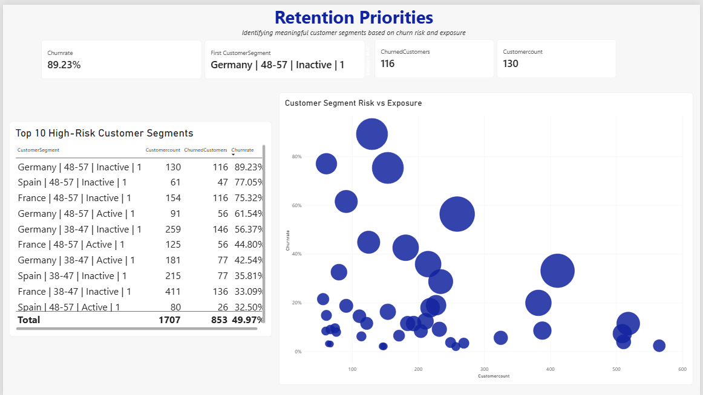

# 🏦 Bank Customer Retention & Churn Analysis

> An end-to-end customer retention analysis identifying the customer characteristics and segments most strongly associated with churn, and where retention efforts could be prioritised.

This project analyses **10,000 European bank customers** to understand customer attrition across demographics, engagement and product ownership. The analysis progresses from exploratory analysis in Excel, through deeper customer segmentation in SQL, to an interactive Power BI dashboard designed to communicate retention priorities clearly.

The goal was not simply to report which customers churned, but to determine **where churn risk is concentrated, whether those patterns persist when customer characteristics are combined, and which meaningful customer segments warrant further investigation**.

---

## 📌 Business Problem

Customer attrition can affect long-term customer relationships and business performance, but an overall churn figure alone does not tell decision-makers **which customers are most at risk or where retention efforts should be focused**.

**The core problem:** the bank has customer-level demographic, account and churn data, but needs to translate it into a clearer understanding of the characteristics and customer segments associated with attrition.

**Why it matters:**

- A bank-wide churn rate can hide substantial differences between customer groups.
- Retention efforts may be inefficient if every customer is treated as equally at risk.
- Extremely high churn rates in very small segments can be misleading if customer population is ignored.
- Understanding where churn is concentrated can help prioritise further investigation and retention testing.

**Key stakeholders:** Customer Retention teams, Customer Experience teams, Product teams and business leadership responsible for monitoring customer attrition and engagement.

---

## 🎯 Project Objective

This analysis was designed to transform customer data into a structured framework for understanding and prioritising churn risk.

Specifically, it aims to:

- Measure the bank's overall customer churn rate.
- Identify customer characteristics associated with higher churn.
- Compare churn patterns across geographic markets.
- Investigate whether age, activity and product ownership interact to create higher-risk profiles.
- Identify meaningful high-risk customer segments.
- Balance **churn risk with customer exposure** when considering retention priorities.
- Translate analytical findings into evidence-based areas for further investigation.

### Business Questions Answered

1. What is the bank's overall churn rate?
2. Which geographic market experiences the highest churn?
3. Which age groups have the highest churn rates?
4. How does customer activity relate to churn?
5. How does product ownership relate to churn?
6. Does balance show the same relationship with churn across different customer groups?
7. Which combinations of customer characteristics create the highest-risk meaningful segments?
8. Are high-risk customer profiles unique to one country or present across multiple markets?
9. Which customer segments should receive the greatest retention attention based on both risk and exposure?

---

## 📊 Dataset Overview

| Attribute | Description |
|---|---|
| **Source** | Maven Analytics – Bank Customer Churn dataset |
| **Rows** | 10,000 customers |
| **Original Columns** | 13 |
| **Industry** | Banking / Financial Services |
| **Geography** | France, Germany and Spain |
| **Target Variable** | `Exited` – whether the customer left the bank |
| **Key Variables** | Geography, Age, Credit Score, Tenure, Balance, Number of Products, Credit Card Ownership, Activity Status, Estimated Salary, Exited |
| **Derived Variables** | Age groups and balance groups created for segmentation |
| **Data Quality** | No duplicate records or missing values identified during validation |
| **Limitations** | No churn reasons, customer satisfaction, complaints, transaction history, product pricing, profitability or longitudinal behavioural data |

> **Important:** The dataset supports identification of associations and high-risk customer segments. It does not establish why customers churned or prove that the observed characteristics caused churn.

---

## 🛠️ Tools & Technologies

| Tool | Purpose |
|---|---|
| **Microsoft Excel** | Data validation, PivotTables and initial exploratory analysis |
| **SQL / SQLite** | Aggregation, conditional analysis and multi-dimensional customer segmentation |
| **Power BI** | Interactive dashboard development and stakeholder-focused reporting |
| **DAX** | Churn-rate measures, customer counts and calculated segmentation fields |
| **GitHub** | Project documentation and portfolio presentation |

---

## 🔄 Methodology

```text
Raw Customer Data
        ↓
Data Validation
        ↓
Exploratory Analysis — Excel
        ↓
Initial Risk Factors Identified
        ↓
Deeper Segmentation — SQL
        ↓
Risk + Exposure Analysis
        ↓
Interactive Reporting — Power BI
        ↓
Retention Priorities
```

**Data Validation** — The dataset was checked for duplicates, missing values, numeric-range issues and inconsistent categories before analysis.

**Exploratory Analysis** — Excel PivotTables were used to establish the overall churn rate and compare churn across geography, age, activity status, number of products, balance, credit score, tenure and credit-card ownership.

**Risk-Factor Identification** — Geography, age, activity status, product ownership and balance emerged as the strongest areas for deeper investigation, while tenure, credit-card ownership and most credit-score groups showed weaker differentiation.

**SQL Segmentation** — SQL was used to move beyond isolated characteristics and investigate how geography, age, activity and product ownership interact.

**Segment Validation** — A minimum population threshold of **50 customers** was applied to the final segmentation. This prevented very small groups with extreme churn percentages from dominating retention priorities.

**Power BI Reporting** — The findings were translated into a two-page interactive dashboard. The first page communicates the overall churn landscape, while the second focuses on meaningful high-risk customer segments and their exposure.

---

## 📈 Dashboard Preview

### Customer Churn Overview


*High-level view of overall churn and how churn rates vary across geography, age, product ownership and customer activity. The geography filter enables interactive comparison between France, Germany and Spain.*

### Retention Priorities



*Customer-segment view designed to identify where retention attention could be prioritised. The bubble chart compares segment churn rate with customer population, with bubble size representing churned-customer volume.*

---

## 📊 Key KPIs

| KPI | Result |
|---|---:|
| **Total Customers** | 10,000 |
| **Churned Customers** | 2,037 |
| **Overall Churn Rate** | 20.37% |
| **Highest-Churn Geography** | Germany – 32.44% |
| **Highest-Churn Age Group** | 48–57 – 55.26% |
| **Inactive Customer Churn Rate** | 26.85% |
| **Active Customer Churn Rate** | 14.27% |
| **Highest-Risk Meaningful Segment** | Germany · 48–57 · Inactive · 1 Product |
| **Highest-Risk Segment Churn Rate** | 89.23% |

---

## 🔍 Key Findings

### 1. Germany has the highest geographic churn rate

- **Germany:** 32.44%
- **Spain:** 16.67%
- **France:** 16.15%

Germany's churn rate is approximately twice that of France and Spain, making it the clearest geographic area for deeper investigation.

---

### 2. Churn is strongly concentrated among customers aged 48–57

| Age Group | Churn Rate |
|---|---:|
| 18–27 | 7.16% |
| 28–37 | 9.56% |
| 38–47 | 24.54% |
| **48–57** | **55.26%** |
| 58–67 | 39.52% |
| 68+ | 11.98% |

Churn rises substantially from the 38–47 group and peaks among customers aged **48–57**.

The pattern is not linear across all ages, however, as churn falls again among customers aged 68+.

---

### 3. Inactive customers have substantially higher churn

- **Inactive customers:** 26.85%
- **Active customers:** 14.27%

Inactive customers therefore churn at almost twice the rate of active customers.

This makes customer activity an important characteristic for identifying retention risk, although the available data cannot determine whether inactivity itself causes churn.

---

### 4. Product ownership has a non-linear relationship with churn

| Number of Products | Churn Rate |
|---|---:|
| 1 | 27.71% |
| 2 | 7.58% |
| 3 | 82.71% |
| 4 | 100.00% |

Customers with **two products have substantially lower churn than customers with one product**.

Customers with three or four products show extremely high churn; however, these populations are much smaller — **266 customers with three products and 60 with four** — so these results require additional investigation rather than a conclusion that additional products cause churn.

---

### 5. Balance-related churn is concentrated within particular customer groups

At an overall level:

- **0–100k balance:** ~15.9% churn
- **100k–200k balance:** ~25.0% churn
- **200k+ balance:** ~55.9% churn

However, the highest balance group contains only **34 customers**, making its headline rate unreliable for broad prioritisation.

Deeper SQL analysis showed that the 100k–200k balance relationship was particularly pronounced in **Germany**, where churn reached approximately **36%**, compared with approximately **17% in France and 16% in Spain**.

This suggests balance should not be interpreted as an isolated churn driver; its relationship with churn differs across customer groups.

---

### 6. Germany's overall churn problem becomes more concentrated among older customers

Within Germany:

| Age Group | Churn Rate |
|---|---:|
| 18–27 | ~10% |
| 28–37 | ~17% |
| 38–47 | ~38% |
| **48–57** | **~69%** |
| 58–67 | ~59% |
| 68+ | ~19% |

This demonstrates that Germany's elevated overall churn is not distributed equally across its customer base.

Customers aged **48–57** represent the most severe age-based concentration.

---

### 7. Combining age and activity reveals substantially greater risk

Among German customers aged **48–57**:

- **Inactive:** ~80% churn
- **Active:** ~54% churn

The elevated churn observed among this age group therefore persists regardless of activity status, but is substantially more severe among inactive customers.

---

### 8. The highest-risk meaningful segment combines multiple characteristics

The final SQL segmentation combined:

**Geography + Age Group + Activity Status + Number of Products**

A minimum segment size of **50 customers** was applied to avoid prioritising statistically fragile groups.

The highest-risk meaningful segment was:

| Characteristic | Result |
|---|---|
| **Geography** | Germany |
| **Age Group** | 48–57 |
| **Activity Status** | Inactive |
| **Products** | 1 |
| **Customers** | 130 |
| **Churned Customers** | 116 |
| **Churn Rate** | **89.23%** |

This compares with a bank-wide churn rate of **20.37%**.

---

### 9. The high-risk profile is not unique to Germany

The same **48–57 · Inactive · 1 Product** profile appears among the highest-risk meaningful segments in every country:

| Geography | Customers | Churned Customers | Churn Rate |
|---|---:|---:|---:|
| **Germany** | 130 | 116 | **89.23%** |
| **Spain** | 61 | 47 | **77.05%** |
| **France** | 154 | 116 | **75.32%** |

Germany has the greatest severity, but the underlying customer profile exists across all three markets.

This changes the interpretation from:

> "Germany is the churn problem"

to:

> **"Germany has the most severe churn, while older, inactive, single-product customers represent a broader cross-market risk profile."**

---

## 💼 Business Impact

The analysis transforms a bank-wide churn figure into a more targeted framework for customer-retention decision-making.

It enables stakeholders to:

- **Prioritise retention investigation** around customer groups with materially elevated churn rather than targeting the entire customer base equally.
- **Identify geographic concentration** by highlighting Germany as the market with the greatest overall churn severity.
- **Recognise cross-market risk patterns** by showing that older, inactive, single-product customers experience elevated churn across France, Germany and Spain.
- **Balance risk with exposure** by considering customer population and churned-customer volume alongside churn percentage.
- **Avoid misleading priorities** by filtering out very small segments that produce extreme percentages but represent few customers.
- **Direct further research** toward the areas where additional behavioural, satisfaction and customer-experience data could provide the greatest value.

> 📌 **In short:** the analysis moves from *"20.37% of customers churn"* to *"these are the meaningful customer groups where churn is most concentrated and where further retention investigation should begin."*

---

## 🚀 Recommendations

| Recommendation | Why It Matters |
|---|---|
| **Prioritise older, inactive, single-product customers for retention investigation** | This profile consistently appears among the highest-risk meaningful segments across all three countries |
| **Investigate Germany-specific customer experience factors** | Germany has substantially higher overall churn than France or Spain, suggesting additional market-specific factors may exist |
| **Identify declining customer engagement earlier** | Inactivity is consistently associated with higher churn and may provide a useful signal for proactive outreach |
| **Investigate the one-product customer experience** | One-product customers have substantially higher churn than two-product customers |
| **Review 3- and 4-product customers separately** | Their extreme churn rates warrant investigation, but their small populations make broad conclusions inappropriate |
| **Use risk and exposure together when prioritising segments** | A high churn percentage alone does not indicate how many customers are affected |
| **Test retention interventions before scaling them** | The analysis identifies associations, not causal effects; proposed interventions should therefore be validated experimentally |

---

## ⚠️ Limitations

The available dataset is suitable for identifying **where churn is concentrated**, but it cannot establish the underlying reasons customers leave.

The dataset does not include:

- Customer complaints
- Customer satisfaction scores
- Reasons for account closure
- Transaction history over time
- Changes in customer engagement over time
- Product pricing or fees
- Service interactions
- Marketing or retention contacts
- Customer profitability or revenue contribution

The analysis should therefore be interpreted as **descriptive and diagnostic segmentation rather than causal analysis**.

In addition, several customer groups — particularly those with three or four products and balances above 200k — contain relatively few customers. Extreme churn percentages in these groups were therefore treated cautiously.

---

## 🔮 Next Steps

The analysis provides a foundation for more advanced customer-retention analytics.

Future development could include:

- **Customer engagement monitoring** — track changes in transaction and account activity over time to identify declining engagement.
- **Churn-reason analysis** — incorporate customer complaints, satisfaction and account-closure reasons.
- **Customer-value analysis** — combine churn risk with profitability or lifetime value to prioritise commercially important customers.
- **Segment monitoring** — track churn rates for high-risk customer segments over time.
- **Retention experimentation** — test targeted interventions using controlled trials or A/B testing.
- **Predictive churn modelling** — develop an early-warning model once sufficient historical and behavioural data is available.
- **Automated reporting** — connect Power BI to a regularly refreshed data source for ongoing retention monitoring.

---

## 📂 Project Structure

```text
Bank-Customer-Retention-Churn-Analysis/
│
├── Excel/
│   └── bank_churn_analysis.xlsx
│
├── SQL/
│   └── bank_churn_analysis.sql
│
├── PowerBI/
│   └── bank_churn_dashboard.pbix
│
├── Images/
│   ├── customer_churn_overview.png
│   └── retention_priorities.png
│
└── README.md
```

---

## ⭐ Skills Demonstrated

`Business Analysis` `Customer Segmentation` `Microsoft Excel` `SQL` `Power BI` `DAX` `Exploratory Data Analysis` `Data Validation` `Data Visualization` `Dashboard Design` `Business Intelligence` `Analytical Thinking` `Stakeholder Communication` `Data Storytelling`

---

## 📚 Key Takeaways

This project reinforced that **the highest percentage is not automatically the highest business priority**. Customer population, exposure and the reliability of each segment must be considered alongside churn rate.

The analysis began with individual characteristics in Excel, progressed into multi-dimensional segmentation in SQL, and concluded with a Power BI dashboard designed around a business decision: **where should retention attention be focused?**

Most importantly, the project demonstrates the ability to move from **data → pattern → deeper investigation → customer segment → business priority**, while recognising the difference between an observed association and a causal explanation.
